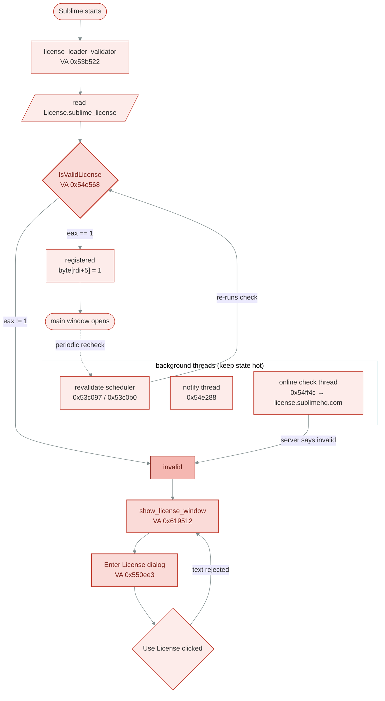
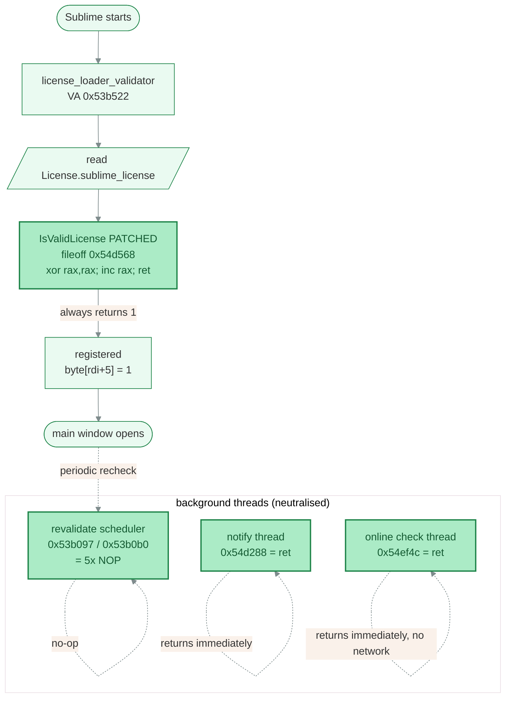
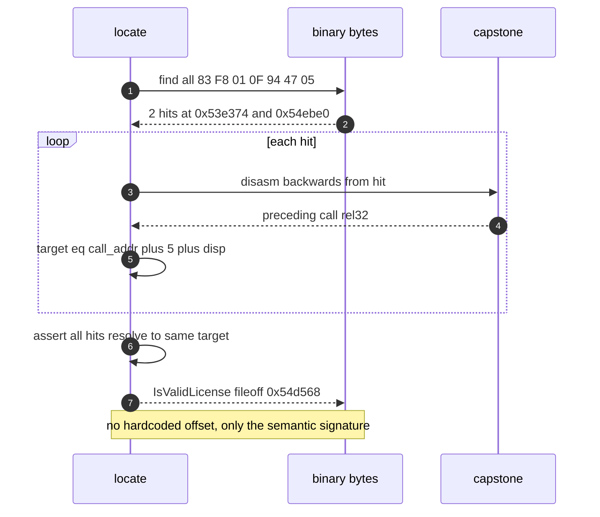

# Sublime Text 4205 (Linux x64) License Patch

> **Reverse-engineering documentation — educational / research use only.**
> This document records interoperability and security research on a copy of
> Sublime Text that the operator already owns. It contains addresses, byte
> facts, and disassembly excerpts of the license-check logic solely to explain
> how the startup check works. Sublime Text is proprietary software of Sublime
> HQ Pty Ltd; this project is **not affiliated with or endorsed by Sublime HQ**
> and ships no Sublime binaries or license keys. Do not use this material to
> avoid a required licence — if you use Sublime Text,
> [buy a license](https://www.sublimehq.com/store/text). See the repository
> `LICENSE`, `DISCLAIMER.md`, and `NOTICE.md`.

> The license patching of the Sublime Text binary is necessary for
> developing/testing a new plugin requiring the new and unreleased python3.14 plugin host.
> Although normal Sublime Text binaries are free to evaluate, any `dev` version (like the Build 4205),
> for whatever reason, forces the plugin developer to purchase a license to test their software against future builds.
> Needless to say, this is suboptimal as a developer who want their software to work on release of new Sublime Text versions.
> Also needless to say: Buy a license if you are a user.
> This patch is meant for developers that want to test their plugins against `dev` builds and for reverse-engineering and security curious engineers.

## Subject binary

| Field       | Value                                                                 |
|-------------|-----------------------------------------------------------------------|
| Program     | Sublime Text, Build **4205**, Linux x64 ELF                           |
| Path        | `/opt/sublime_text/sublime_text`                                      |
| Clean md5   | `c7539dda818f0c3537ba6cfa0f872fa9`                                    |
| Plugin host | `plugin_host-3.14` — the plugin runtime inside Sublime; this repo's own toolchain is Python 3.12 (`.python-version`), not 3.14           |
| ELF mapping | `.text` fileoff `0x3138d0` / VA `0x3148d0`; **VA = fileoff + 0x1000** |
| `.rodata`   | VA == fileoff for the string offsets below                            |

> **Scope:** this document works the patch through on build **4205** (the
> concrete, hand-verified record). The shipped patcher is **build-agnostic across
> 4176-4207** by resolving every site structurally rather than by 4205 offsets;
> for the cross-build story, per-build tables, and the 4175 roadblock see
> [`cross-build-generalization.md`](cross-build-generalization.md).

## Result (TL;DR)

The proven, repeatable patch is recipe **PATCH-4205-A** - the Linux Build 4200 recipe ([gist `feaa63c`](https://gist.github.com/maboloshi/feaa63c35f4c2baab24c9aaf9b3f4e47?permalink_comment_id=5597063#gistcomment-5597063)) ported to 4205, with the license-validity function returning the 4205 "valid" enum value of **1** (not 0).

| Recipe             | md5                                | Patches        | Status                |
|--------------------|------------------------------------|----------------|-----------------------|
| **PATCH-4205-A**   | `4eec4c3506773e9899cdbe8e463ab9c0` | S1..S5         | **CONFIRMED WORKING** |
| PATCH-4205-A-hosts | `b2ad2138435a548bbe7093a5807bba30` | S1..S5 + hosts | built                 |
| PATCH-4205-B       | `d36770200e4c710854b969dc77baff3e` | S4 only        | built                 |

After installing PATCH-4205-A, manual verification confirms the patched test
copy reaches the normal main-window startup path: the license window no longer
gates startup, a license file is written under
`~/.config/sublime-text/Local/`, and every later launch skips the license
window entirely. This documents the observed behavior of the patched check; it
is not a usage instruction.

## Glossary - abbreviations and concepts

### ELF (Executable and Linkable Format)

The native binary container format for executables, shared libraries and object files on Linux (and most Unix systems).

The `sublime_text` is a 64-bit ELF binary with:

* a fixed header
* a **program header table** describing how segments map into memory at load time
* **sections** (`.text` = code, `.rodata` = read-only constants/strings, `.data` = writable data, etc.).

Two facts about ELF drive this whole document:

1. a section's **file offset** (where bytes live on disk) differs from its load **VA** (see below) by the segment mapping;
2. the program is position-independent (PIE), so code uses RIP-relative addressing - which is why the durable way to relocate a patch site is a byte signature, not an absolute address.

ELF headers for this build are dumped via `readelf --all sublime_text > research/ELF/sublime_text.readelf-all.txt`.

### VA (Virtual Address)

The address an instruction has **once the ELF is loaded into memory**, as shown by a disassembler (e.g. `54e568`). It differs from the **file offset** (the byte position inside the on-disk file, e.g. `0x54d568`). For this binary the two are related by a fixed bias: **VA = fileoff + 0x1000** (because `.text` is mapped at `0x3148d0` while living at file offset `0x3138d0`). The patcher writes at **file offsets**; the disassembly listings quote **VAs**. Always convert with the bias.

### Vtable accessor

Sublime's license object is a C++ object with a **vtable** (virtual function table): a hidden array of function pointers the object carries so that calls like `obj->is_valid()` are *dispatched* through `call [vtable + slot]` rather than a direct `call function`. A **vtable accessor** is one of those small getter functions (e.g. `is_license_valid_accessor` at `0x6194c8`) whose pointer lives in a vtable slot (`0x929988`).

_Patching the accessor body looks tempting, but because the real call goes through the **slot**, overwriting the getter did not change the dispatched result - which is exactly why the **EXP-VTABLE** experiment failed. The decisive function (`IsValidLicense` `0x54e568`) is called **directly**, so patching its body works._

### Experiments and recipes

This project names attempts by the **strategy** they test, never by an opaque letter. Full definitions and the cross-version source map live in [`sources-and-version-map.md`](sources-and-version-map.md).

**Experiments** (what strategy was tested):

| Strategy       | What it patches                                                | IsValidLicense returns | Result                                               |
|----------------|----------------------------------------------------------------|------------------------|------------------------------------------------------|
| **EXP-VTABLE** | vtable getter `0x6194c8` and/or dialog builder `0x550ee3`      | n/a                    | FAILED - vtable-dispatched, window persisted         |
| **EXP-RET0**   | the 5 real sites, `IsValidLicense → mov rax,0`                 | **0**                  | FAILED - 4205 callers `cmp eax,1`, 0 read as invalid |
| **EXP-RET1**   | the same 5 sites, `IsValidLicense → xor rax,rax; inc rax; ret` | **1**                  | **WORKS**                                            |

`EXP-RET0` is the straight forward-port of the Linux Build 4200 recipe ([gist `feaa63c`](https://gist.github.com/maboloshi/feaa63c35f4c2baab24c9aaf9b3f4e47?permalink_comment_id=5597063#gistcomment-5597063)) which used `mov rax,0` because pre-4205 callers compared against 0. `EXP-RET1` flips that one return value to 1, as required by the 4205 `cmp eax,1` convention.

**Recipes** (the shippable deliverables encoded in `st4patcher/constants.py`):

| Recipe                 | Sites               | hosts block | md5 (4205)                         | Status                |
|------------------------|---------------------|-------------|------------------------------------|-----------------------|
| **PATCH-4205-A**       | all 5, ret1         | no          | `4eec4c3506773e9899cdbe8e463ab9c0` | **CONFIRMED WORKING** |
| **PATCH-4205-A-hosts** | all 5 + hosts       | yes         | `b2ad2138435a548bbe7093a5807bba30` | works                 |
| **PATCH-4205-B**       | IsValidLicense only | no          | `d36770200e4c710854b969dc77baff3e` | minimal               |

## All identified hex markers (used and unused)

Every license-related landmark found during RE.

### Raw string literals

> Using ELF `.rodata` where VA == fileoff

| String                      | Offset    | Xref'd from (VA)       | Meaning                                     |
|-----------------------------|-----------|------------------------|---------------------------------------------|
| `License.sublime_license`   | `0xd1a5c` | `0x53b6ac`, `0x54e14d` | on-disk license filename                    |
| `Enter License`             | `0xd74a5` | `0x550fbe`             | "Enter License" dialog caption              |
| `license_window`            | `0xeac1a` | `0x54430d`             | window id                                   |
| `show_license_window`       | `0xed07a` | `0x619512`             | API name for the show-window accessor       |
| `sublime-license-check/3.0` | `0xefdcc` | `0x5503af`             | HTTP User-Agent for online check            |
| `license.sublimehq.com`     | `0xcf39c` | `0x55036f`             | phone-home host (optional `--hosts` target) |
| `Unregistered`              | `0xf0fde` | `0x61910e`             | title-bar text                              |
| `license_lapse_timestamp`   | `0xeef83` | (no direct ref)        | lapse bookkeeping key                       |

To get a full list of all strings: `llvm-strings-18 sublime_text > sublime_text.4205.strings.txt`.

### Functions / accessors

The **Patched** column states whether the proven PATCH-4205-A recipe touches it.

| Name                                  | VA         | Role                                                   | Patched?                  |
|---------------------------------------|------------|--------------------------------------------------------|---------------------------|
| **IsValidLicense** (validity enum fn) | `0x54e568` | returns the license-validity enum; callers `cmp eax,1` | **YES → return 1**        |
| revalidate scheduler call #1          | `0x53c097` | schedules a license revalidation callback              | **YES → nop**             |
| revalidate scheduler call #2          | `0x53c0b0` | schedules a license revalidation callback              | **YES → nop**             |
| license notify thread entry           | `0x54e288` | background notify thread                               | **YES → ret**             |
| online license check thread           | `0x54ff4c` | background online check thread                         | **YES → ret**             |
| `phone_home_check`                    | `0x5503af` | builds `sublime-license-check/3.0` request             | no (hosts block optional) |
| `enter_license_dialog_builder`        | `0x550ee3` | builds the "Enter License" dialog                      | no (earlier dead-end)     |
| `license_loader_validator`            | `0x53b522` | loads + validates `License.sublime_license`            | no                        |
| `is_license_valid_accessor`           | `0x6194c8` | vtable getter: `cmp byte[rax+5],1` → al                | no (earlier dead-end)     |
| `invalid_neg_accessor`                | `0x619500` | vtable getter: `byte[rax+5] xor 1`                     | no                        |
| `show_license_window_accessor`        | `0x619512` | vtable getter: returns show_license_window             | no                        |
| `license_reload_fn`                   | `0x619478` | vtable: reload license                                 | no                        |

### Vtable accessor relocations (RELA, type 8 = R_X86_64_RELATIVE)

| Accessor fn                    | VA         | vtable slot |
|--------------------------------|------------|-------------|
| `show_license_window_accessor` | `0x619512` | `0x929820`  |
| `invalid_neg_accessor`         | `0x619500` | `0x929900`  |
| `is_license_valid_accessor`    | `0x6194c8` | `0x929988`  |
| `license_reload_fn`            | `0x619478` | `0x929a38`  |

> The `0x6194c8` cluster getters are **vtable-dispatched**, so a direct overwrite of the getter did not change the startup decision (experiment EXP-VTABLE).
> The decisive function is the non-dispatched `IsValidLicense` at `0x54e568`.

## The PATCH-4205-A patch sites (exact bytes)

All patches are **size-preserving** (file length stays `9878848`). Offsets are **file offsets**; the disassembly VA = fileoff + `0x1000`.

| #  | Name                   | Fileoff    | Original bytes            | Patched bytes             | Effect                                                        |
|----|------------------------|------------|---------------------------|---------------------------|---------------------------------------------------------------|
| S1 | nop1 revalidate cb     | `0x53b097` | `e8 14 90 0e 00`          | `90 90 90 90 90`          | NOP a `call` that schedules license revalidation              |
| S2 | nop2 revalidate cb     | `0x53b0b0` | `e8 fb 8f 0e 00`          | `90 90 90 90 90`          | NOP a second revalidation-scheduling `call`                   |
| S3 | ret_notify1            | `0x54d288` | `41`                      | `c3`                      | Turn the license-notify thread fn into an immediate `ret`     |
| S4 | **IsValidLicense → 1** | `0x54d568` | `55 41 57 41 56 41 55 41` | `48 31 c0 48 ff c0 c3 90` | `xor rax,rax; inc rax; ret; nop` → always returns 1 (= valid) |
| S5 | ret_notify2            | `0x54ef4c` | `41`                      | `c3`                      | Turn the online-check thread fn into an immediate `ret`       |

Optional phone-home block (recipe PATCH-4205-A-hosts, `--hosts`):

| # | Name  | Fileoff   | Original bytes          | Patched bytes        | Effect                                                      |
|---|-------|-----------|-------------------------|----------------------|-------------------------------------------------------------|
| H | hosts | `0xcf39c` | `license.sublimehq.com` | `127.0.0.1\0\0\0...` | redirect license host to loopback (NUL-padded, same length) |

### Why S4 must return 1, not 0

The Linux Build 4200 recipe ([gist `feaa63c`](https://gist.github.com/maboloshi/feaa63c35f4c2baab24c9aaf9b3f4e47?permalink_comment_id=5597063#gistcomment-5597063))
used `mov rax,0` (return 0). On 4205 every caller of `IsValidLicense` (`0x54e568`) compares against **1**:

```asm
; caller 0x53dd7e
53dd7e: call 0x54e568
53dd83: cmp eax, 1
53dd86: jne 0x53dd9e        ; not-1 → treat as invalid

; caller 0x53f36b  (also sets the "registered" flag)
53f36b: call 0x54e568
53f374: cmp eax, 1
53f377: sete byte ptr [rdi + 5]   ; flag[5] = (eax == 1)

; caller 0x54fbd4  (same flag-set pattern)
54fbd4: call 0x54e568
54fbe0: cmp eax, 1
54fbe3: sete byte ptr [rdi + 5]
```

So returning **0** made 4205 see "invalid" and re-show the window; returning
**1** satisfies all four callers and sets the registered flag `byte[rdi+5]`.

### S4 before / after disassembly

```asm
; BEFORE (clean) - IsValidLicense prologue
54e568: push rbp
54e569: push r15
54e56b: push r14
54e56d: push r13
54e56f: push r12
54e571: push rbx

; AFTER (PATCH-4205-A) - return 1
54e568: xor rax, rax     ; 48 31 c0
54e56b: inc rax          ; 48 ff c0
54e56e: ret              ; c3
54e56f: nop              ; 90  (padding; original push rbx tail is now dead)
```

## Control flow - before vs after

### Startup license gate (BEFORE patch)



The gate (red) can route to the license window whenever the local file is missing/invalid, **or** when a background thread re-runs the check and flips the state. To keep the window gone we must neutralise both the gate **and** the threads that re-trigger it.

### Startup license gate (AFTER PATCH-4205-A patch)



Net effect: the only reachable path is **valid &rarr; main window**. The revalidation callbacks are NOPed and the notify/online-check threads return immediately, so nothing can flip the state back to invalid. Entering any text once writes a local license file, after which the window never appears again.

### How the signature locator resolves IsValidLicense

The signature is `cmp eax,1 ; sete byte[rdi+5]` (`83 F8 01 0F 94 47 05`); disassembling backwards from each hit to the preceding `call rel32` yields the function address.



## Files involved

### Repository (`sublime-text-4-dev-patcher`)

| Path                                           | Role                                                                                           |
|------------------------------------------------|------------------------------------------------------------------------------------------------|
| `st4patcher/` (`uv run st4patch`)              | **Canonical repeatable patcher** (PATCH-4205-A recipe, `--hosts`, `--verify-only`, `--locate`) |
| `research/sublime-4205-license-patch.md`       | This document                                                                                  |
| `research/sources-and-version-map.md`          | Real source links + SublimeText version/OS/patch map                                           |
| `research/st4205-license-map.md` / `.json`     | Raw string xrefs, accessor relocs, disassembly dumps                                           |
| `scripts/sublime-trace-startup`                | strace startup file/network activity                                                           |
| `binaries/patches-candidates/`                 | Built binaries (PATCH-4205-A/-A-hosts/-B + superseded EXP-VTABLE/EXP-RET0 experiments)         |

### System paths

| Path                                                   | Role                                    |
|--------------------------------------------------------|-----------------------------------------|
| `/opt/sublime_text/sublime_text`                       | live binary (PATCH-4205-A installed)    |
| `~/.config/sublime-text/Local/License.sublime_license` | written after entering any license text |

## Repeatable procedure

### Patch a user-owned copy (no sudo)

```bash
cd ~/Code/sublime-text-4-dev-patcher

# clean source -> patched copy in /tmp
uv run st4patch \
    --src binaries/clean-original/4205-linux-amd64/sublime_text \
    --out /tmp/sublime_text.PATCH-4205-A

# expected: out md5 = 4eec4c3506773e9899cdbe8e463ab9c0
```

Add `--hosts` to also apply the `license.sublimehq.com → 127.0.0.1` block
(recipe PATCH-4205-A-hosts).

### Verify a binary without patching

```bash
uv run st4patch --src /opt/sublime_text/sublime_text --verify-only
# prints CLEAN / PATCHED / MISMATCH per site. Only --verify-only is safe to
# re-run on an already-patched binary: the patch destroys the notify-prologue
# first byte (0x41 -> 0xc3), so --locate/patch on a patched binary fails with
# "signature not unique (0 hits)" — the sites are NOT no-op'd.
```

### Install (owner, sudo)

```bash
pkill sublime_text
sudo cp /tmp/sublime_text.PATCH-4205-A /opt/sublime_text/sublime_text
subl
# In the license window, type ANY text -> "Use License" -> main window opens.
```

## Reproducibility guarantees

- The clean-md5 check is **advisory only**: a mismatch prints a WARNING
  ("proceeding by signature") and patching continues via structural locate —
  `KNOWN_CLEAN_MD5` is never enforced.
- Every patch site is resolved structurally (locate); ambiguity (zero or
  several candidates) is reported as a hard error, never guessed, so a
  different build cannot be silently mis-patched.
- After writing, the patch is **self-verified** (`verify_located`): the patched
  sites are re-located and compared against the expected payload, and the
  patcher aborts on any mismatch. (The per-site original-byte assertion exists
  only in the legacy SITES path used by tests, not in the live patch path.)
- Each patch is byte-length-equal to the original, so the ELF is not resized
  and no offsets shift.
- Running the patcher on the clean 4205 source deterministically yields md5
  `4eec4c3506773e9899cdbe8e463ab9c0` (PATCH-4205-A).
- The patcher is **not** idempotent on an already-patched binary: the patch
  destroys the notify-prologue signature, so `--locate`/patching fails with
  "signature not unique (0 hits)"; only `--verify-only` is safely re-runnable.

## History of dead-ends (why earlier candidates failed)

| Experiment   | What it patched                                             | Why it failed                                                                                                                      |
|--------------|-------------------------------------------------------------|------------------------------------------------------------------------------------------------------------------------------------|
| EXP-VTABLE   | vtable getter `0x6194c8` and/or dialog builder `0x550ee3`   | getters are vtable-dispatched; overwriting the getter body did not change the dispatched call result, so the window still appeared |
| EXP-RET0     | full 5-site set but `IsValidLicense → mov rax,0` (return 0) | 4205 callers `cmp eax,1`; return 0 reads as invalid, window persisted                                                              |
| **EXP-RET1** | full 5-site set, `IsValidLicense → return 1`                | matches the 4205 valid enum; **works** → recipe PATCH-4205-A                                                                       |

The decisive insight (the
[`rainbowpigeon/sublime-text-4-patcher`](https://github.com/rainbowpigeon/sublime-text-4-patcher)
architecture reads the return convention from the caller's compare rather than
hardcoding it) is what turned EXP-RET0 into the working EXP-RET1 / PATCH-4205-A.
On 4205 the callers do `cmp eax,1`, so the valid value is 1. (The convention is
not a clean `< 4205` / `>= 4205` split across all builds; see
[`cross-build-generalization.md`](cross-build-generalization.md).)

## Finding the patch sites in a FUTURE version (signatures, not offsets)

Fixed file offsets (`0x54d568` …) are valid **only for build 4205**. Every new build relays out `.text`, so the offsets move. The durable way to re-find each site is a **byte signature**: a short, distinctive instruction pattern that survives recompilation, optionally followed by resolving a relative `call`/`lea`
target. This is the same technique the public `rainbowpigeon` patcher uses
(wildcard `?` bytes, `ref="call"` to follow a call, and multiple fallback signatures per target).

`st4patcher/locate_sites.py` implements this for our five sites. Run it on any clean 4205+ binary to recover the offsets:

```bash
uv run python -m st4patcher.locate_sites <clean sublime_text>
# located 5 sites:
#   nop1   fileoff=0x53b097  byte=e8
#   nop2   fileoff=0x53b0b0  byte=e8
#   ret_notify1     fileoff=0x54d288  byte=41
#   isvalidlicense  fileoff=0x54d568  byte=55
#   ret_notify2     fileoff=0x54ef4c  byte=41
```

Cross-check signatures against the hardcoded offsets for the current build:

```bash
uv run st4patch --src <clean sublime_text> --locate
# prints OK/DIFF per site and "LOCATE: MATCH"
```

### The signatures and why each is stable

| Site               | Signature (hex)                       | Meaning                                                 | How it resolves                                                                                                                                                             |
|--------------------|---------------------------------------|---------------------------------------------------------|-----------------------------------------------------------------------------------------------------------------------------------------------------------------------------|
| **IsValidLicense** | `83 F8 01 0F 94 47 05`                | `cmp eax,1 ; sete byte[rdi+5]`                          | the license-registered flag store; appears only at IsValidLicense call sites on 4205+. Disassemble **backwards** to the preceding `call rel32`; its target is the function. |
| **ret_notify1**    | `41 57 41 56 41 54 53 48 81 EC 08 03` | `push r15;r14;r12;rbx; sub rsp,0x308`                   | unique function prologue; the matched offset **is** the site (flip first byte `41`→`c3`).                                                                                   |
| **ret_notify2**    | `41 57 41 56 53 89 F3 49 89 FE 6A 20` | `push r15;r14;rbx; mov ebx,esi; mov r14,rdi; push 0x20` | unique prologue; matched offset is the site.                                                                                                                                |
| **nop1 / nop2**    | `BA 88 13 00 00 E8`                   | `mov edx, 0x1388 ; call rel32`                          | `0x1388` (=5000, a revalidation interval) anchors the pair. nop1 = the call at match+5; nop2 = the next `call <same target>` in the block.                                  |

Why these survive a rebuild:

- **IsValidLicense** is anchored by a *semantic* fingerprint (`cmp eax,1` then store into the license object's `+5` flag), not by position. Even if the function moves, the caller still compares against 1 and sets the flag.
- **ret_notify1/2** are anchored by **full, unusual prologues** (specific push order + exact `sub rsp` immediate / `push 0x20`), which are unique in
  `.text`.
- **nop1/nop2** are anchored by the **constant `0x1388`** loaded immediately before the scheduler call - constants are far more stable than code layout.

### Recipe to port to a brand-new build

1. Do **not** assume the return convention from the build number. The value a
   build treats as "valid" is non-monotonic (0 on most builds, 1 on 4202/4205,
   0x118 on 4201). The locator reads it from each caller's `cmp` and emits the
   matching stub automatically, so you do not need to pick it by hand. (Details:
   [`cross-build-generalization.md`](cross-build-generalization.md).)
2. Run `uv run python -m st4patcher.locate_sites` on the **clean** binary; it
   prints the five offsets and the inferred valid-return value.
3. If a signature yields 0 or >1 hits, widen it: keep opcodes + constants, turn changed bytes (relative offsets, register fields) into wildcards, and add the variant as a fallback (mirror the `Sigs` fallback-chain idea).
4. Feed the located offsets into the patch step. Because the patches are size-preserving and the original bytes are asserted, a wrong location aborts rather than corrupts.

> The prologue signatures for `ret_notify1/2` intentionally match **clean** code
> only (they include the original first byte `0x41`). Always locate on a clean
> binary, then patch - never locate on an already-patched binary.

## Precautions: crash_handler and the phone-home block

### Disable the crash handler (recommended for a patched binary)

`/opt/sublime_text/crash_handler` is the helper Sublime launches to collect and
**upload crash reports** to the vendor. With a modified main binary you do not want crash telemetry leaving the machine (a patched build can crash in unusual ways, and the report could include identifying data). Disabling it is a safe, reversible precaution:

```bash
sudo chmod a-x /opt/sublime_text/crash_handler   # remove execute bit -> cannot run
# re-enable later with:
# sudo chmod a+x /opt/sublime_text/crash_handler
```

Removing the execute bit means Sublime cannot spawn it; the editor keeps working normally. This is the lighter-weight, fully local option and is **recommended**.

### The optional `--hosts` phone-home block

```text
H  hosts   0xcf39c   "license.sublimehq.com" -> "127.0.0.1\0..."  (same length, NUL-padded)
```

This rewrites the license server hostname **inside the binary** so any online license check resolves to loopback instead of the vendor. It is **optional** and, for our purposes, **not required**:

- The strace of startup showed **no network license check in the first ~8s** - validation is driven by the **local** `License.sublime_license` file, not a live server call at launch.
- The PATCH-4205-A patch already neutralises the online-check thread
  (`ret_notify2` → `ret`) and the revalidation scheduler (nop1/nop2), so nothing initiates the request in the first place.

### Recommendation

| Goal                                      | Action                                                                                                                                                                                                  |
|-------------------------------------------|---------------------------------------------------------------------------------------------------------------------------------------------------------------------------------------------------------|
| Stop crash telemetry from a patched build | **Yes - `chmod a-x crash_handler`** (local, reversible, recommended)                                                                                                                                    |
| Block license phone-home                  | Not needed for PATCH-4205-A; the online-check thread is already `ret`-stubbed. Apply `--hosts` (recipe PATCH-4205-A-hosts) only as defense-in-depth if you want the hostname neutralised in-binary too. |

In short: prefer `chmod a-x /opt/sublime_text/crash_handler`. The `--hosts` block is belt-and-suspenders and can be layered on (recipe **PATCH-4205-A-hosts**) but is not required for the window to stay gone.
